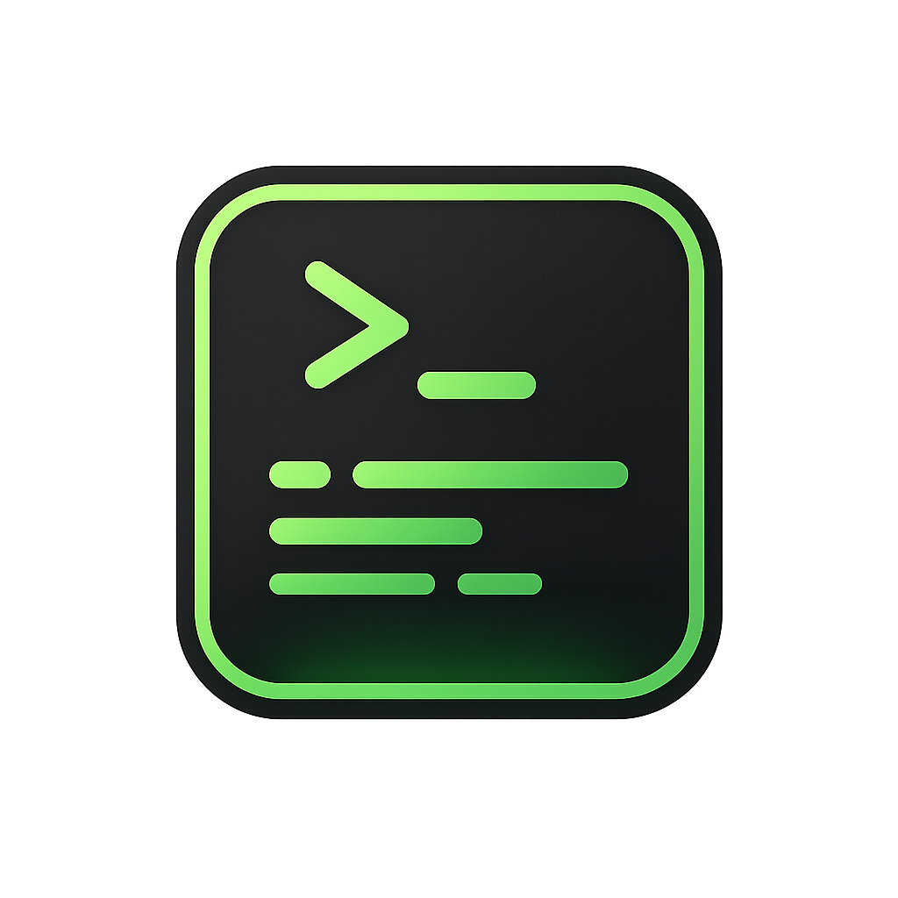

# FluxDev

<p align="center">
  
</p>

<p align="center">
  <b>Run your projects. Instantly.</b>
</p>

---

## Descripcion

**FluxDev** es una app de escritorio hecha con Electron para centralizar y ejecutar proyectos locales sin abrir multiples terminales manualmente.

Menos friccion. Mas flujo.

---

## Objetivo

Reducir pasos repetitivos del dia a dia:
- Abrir terminal
- Navegar carpetas
- Ejecutar comandos manualmente

Todo desde una sola interfaz.

---

## Caracteristicas actuales

- Gestion de proyectos locales (crear, editar, eliminar)
- Soporte de multiples comandos por proyecto
- Ejecucion y detencion de procesos
- Panel de procesos con estado, PID y salida reciente
- Multi-run secuencial por proyecto para ejecutar toda la cola de comandos
- Terminal embebida por proyecto con shell interactivo para comandos manuales
- Iconos por URL (Devicon, Simple Icons) o archivo local
- Perfiles de entorno por proyecto para reutilizar variables y contexto de ejecucion
- Persistencia local con electron-store (con migracion automatica desde projects.json legado)
- Dashboard con estadisticas y actividad reciente
- Historial de ejecuciones en sesion (filtros por proyecto y estado)
- Vista Acerca de con informacion del sistema
- Onboarding para nuevos usuarios

### En progreso / siguiente
- Logs mas completos por proceso (historial extendido)
- Auto-deteccion de proyectos
- Favoritos y filtros
- Integracion con Git

---

## Identidad visual

Tema: Neon Dev

- Verde neon: `#39FF14`
- Negro profundo: `#0A0A0A`
- Gris oscuro: `#1A1A1A`
- Verde suave (hover): `#2ECC71`

Concepto: flujo, energia y control con interfaz oscura y acentos brillantes.

---

## Instalacion

```bash
git clone https://github.com/tu-usuario/fluxdev.git
cd fluxdev
npm install
npm start
```

---

## Scripts

```bash
npm start      # Inicia la app en desarrollo
npm run package # Empaqueta la app
npm run make    # Genera instaladores/distribuibles
```

Nota: el script `npm test` aun es placeholder.

---

## Stack

- Electron
- Node.js
- HTML / CSS / JavaScript

---

## Estructura

### Estructura objetivo (guia)

```text
fluxdev/
├── public/
│   └── FluxLogo.png
├── main.js
├── preload.js
├── renderer/
│   ├── index.html
│   ├── styles.css
│   └── app.js
└── package.json
```

### Estado actual (implementado)

```text
fluxdev/
├── public/
│   └── FluxLogo.png
├── main.js
├── preload.js
├── renderer/
│   ├── index.html
│   ├── styles.css
│   ├── app.js
│   └── terminal-loader.js
├── forge.config.js
└── package.json
```

---

## Configuracion de proyectos

Modelo usado actualmente:

```json
[
  {
    "id": "m6k7f2",
    "name": "Mi App",
    "path": "C:/proyectos/app",
    "commands": [
      "npm install",
      "npm run dev"
    ],
    "icon": "https://cdn.jsdelivr.net/gh/devicons/devicon/icons/react/react-original.svg",
    "createdAt": "2026-04-10T18:34:21.000Z"
  }
]
```

---

## Persistencia (electron-store)

- Los proyectos se guardan en el directorio userData del sistema operativo.
- Al iniciar, se ejecuta una migracion one-shot: si existe projects.json legado en userData y el store esta vacio, se importan esos proyectos.
- Despues de migrar, el flag interno projectsMigratedFromJson evita repetir la importacion.


---

## Uso rapido

1. Abre FluxDev
2. Agrega un proyecto (nombre, ruta, comandos, icono)
3. Pulsa Ejecutar sobre el comando deseado
4. Monitorea estado y salida en la pestaña Procesos
5. Usa la pestaña Terminal para escribir comandos manuales dentro del proyecto
6. Revisa el historial de ejecuciones en la pestaña Historial
7. Consulta informacion del sistema en Acerca de
8. Deten el proceso cuando lo necesites

---

## Roadmap

- [x] CRUD de proyectos
- [x] Soporte multi-comando
- [x] Ejecucion y detencion de procesos
- [x] Vista de procesos con PID/estado
- [x] Terminal embebida completa
- [x] Multi-run avanzado
- [x] Perfiles de entorno
- [x] Integracion con Git
- [x] Exportar / importar configuraciones
- [x] Dashboard con estadisticas
- [x] Historial de ejecuciones
- [x] Vista Acerca de
- [x] Onboarding para nuevos usuarios

---

## Contribuciones

Pull requests bienvenidos.

---

## Licencia

MIT

---

<p align="center">
  <b>Click. Run. Build.</b>
</p>
